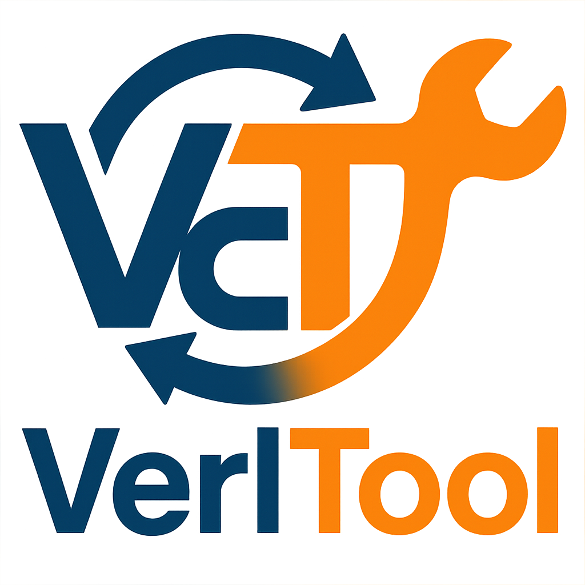
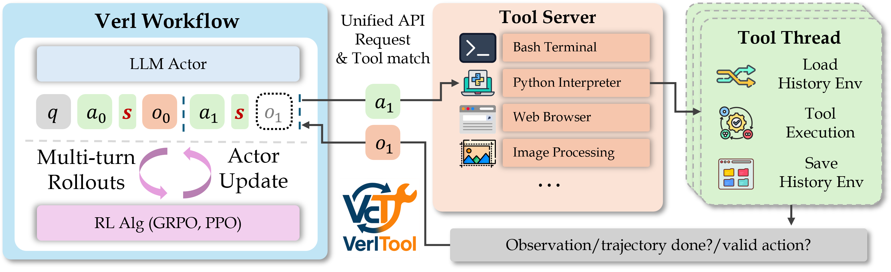

# Verl-Tool

<p align="center">
  <picture>
    <source media="(prefers-color-scheme: dark)" srcset="assets/imgs/logo.png">
    
  </picture>
</p>

<h3 align="center">
VerlTool: A unified and easy-to-extend tool-agent training framework based on verl.
</h3>

<p align="center">
| 
<a href="https://github.com/TIGER-AI-Lab/verl-tool?tab=readme-ov-file#installation"><b>Quick Start</b></a> |
  <a href="https://github.com/TIGER-AI-Lab/verl-tool/tree/main/examples/data_preprocess"><b>Data</b></a> |
  <a href="https://github.com/TIGER-AI-Lab/verl-tool/tree/main/examples/train"><b>Training Scripts</b></a> |
  <a href="https://github.com/TIGER-AI-Lab/verl-tool/tree/main/benchmarks"><b>Evaluation</b></a> |
  <a href="https://deepwiki.com/TIGER-AI-Lab/verl-tool"><b>DeepWiki</b></a> |
  <a href="https://github.com/TIGER-AI-Lab/verl-tool/tree/main/assets/imgs/wechat_group.jpg"><b>WeChat Group</b></a> |
  <a href="https://discord.gg/CUARJFJ8"><b>Discord</b></a>
|
</p>

---

## Table of Contents
- [News](#news)
- [Features](#features)
- [Installation](#installation)
- [Design and Architecture](#design-and-architecture)
  - [Design Overview](#design-overview)
  - [AgentActorConfig Parameters](#agentactorconfig-parameters)
  - [Configuration Examples](#configuration-examples)
  - [Tool Server Design](#tool-server-design)
  - [Tool Server Usage](#tool-server-usage)
- [Training](#training)
  - [Data Preprocessing](#data-preprocessing)
  - [Single Node Training](#single-node-training)
  - [Multi Node Training](#multi-node-training)
  - [Training Logs](#training-logs)
- [Evaluation](#evaluation)
  - [Evaluation Service Setup](#evaluation-service-setup)
  - [Testing the API Service](#testing-the-api-service)
  - [Math Benchmark Results](#math-benchmark-results)
- [Model Checkpoints](#model-checkpoints)
- [Contributing](#contributing)
  - [Adding New Tools](#adding-new-tools)
  - [Creating New Reward Managers](#creating-new-reward-managers)
- [ToDos](#todos)
- [Core Contributors](#core-contributors)
- [Advisors](#advisors)
- [Acknowledgements](#acknowledgements)
- [Star History](#star-history)


## News
+ [2025/06/13] We integrated [DeepWiki](https://deepwiki.com/TIGER-AI-Lab/verl-tool) for Verl-Tool. Feel free to browse the AI-generated docs and chat with Verl-tool codes.
+ [2025/06/06] We have updated a detailed design overview in the README, including how to add new tools, how to use the tool server, and how to train your own models with verl-tool.
+ [2025/05/31] We released the Verl-tool training/evaluation code with ToRL training as an initial example (see [X post](https://x.com/DongfuJiang/status/1929198238017720379)). We are working on the paper and will release it very soon.

## Features

- 🔧 **Complete decoupling of actor rollout and environment interaction** - We use verl as a submodule to benefit from ongoing verl repository updates. All tool calling is integrated via a unified API, allowing you to easily add new tools by simply adding a Python file and testing independently.
- 🌍 **Tool-as-environment paradigm** - Each tool interaction can modify the environment state. We store and reload environment states for each trajectory.
- ⚡ **Native RL framework for tool-calling agents** - verl-tool natively supports multi-turn interactive loops between agents and their tool environments.
- 📊 **User-friendly evaluation suite** - Launch your trained model with OpenAI API alongside the tool server. Simply send questions and get final outputs with all interactions handled internally. See [benchmarks](benchmarks).



## Installation

We highly recommend using uv to install verl-tool.

```bash
git submodule update --init --recursive
pip install uv # if not installed
uv sync
source .venv/bin/activate
uv pip install -e verl
uv pip install vllm==0.8.4
uv pip install flash-attn --no-build-isolation
uv pip install -e ".[acecoder,torl]"
uv pip install dill==0.4.0 fsspec==2025.3.2 protobuf==5.29.4
```

### Conda Installation
```bash
git submodule update --init --recursive
conda create --name verl-tool-env python=3.10
conda activate verl-tool-env
pip install -e .
pip install -e verl
pip install vllm==0.8.4
pip install flash-attn --no-build-isolation
pip install -e ".[acecoder,torl]"
pip install dill==0.4.0
pip install fsspec==2025.3.2
pip install protobuf==5.29.4
```

## Design and Architecture

### Design Overview

Verl-Tool is designed to decouple the RL training and the tool calling processes. The RL training components (computation of logp, reward, advantages, RL algorithms, etc.) are handled by the verl framework, while the tool calling process is managed by the tool server **through an additional plugin to the verl rollout**.

We achieve this by inheriting from `ActorRolloutRefWorker` → `AgentActorRolloutRefWorker` in [verl_tool/agent_workers/fsdp_workers.py](verl_tool/agent_workers/fsdp_workers.py) and then overriding the original RefWorker in [verl_tool/trainer/main_ppo](verl_tool/trainer/main_ppo.py) by adding this line:

```python
from verl_tool.trainer.ppo.ray_trainer import AgentRayPPOTrainer as RayPPOTrainer
```

We only modify one function after inheriting the `ActorRolloutRefWorker` class: the `generate_sequences` function. We add a conditional statement to delegate the agent rollout process to `AgentActorManager.run_llm_loop` in [verl_tool/llm_agent/manager.py](verl_tool/llm_agent/manager.py):

```python
class AgentActorRolloutRefWorker(Worker, ActorRolloutRefWorker, metaclass=AgentActorRolloutRefWorkerMeta):
    def __agent_init__(self, config: DictConfig, role: str):
        # agent init
        ...
        self.manager = AgentActorManager(...)
        ...
    
    @register(dispatch_mode=Dispatch.DP_COMPUTE_PROTO)
    def generate_sequences(self, prompts: DataProto):
        ...
            if not self.agent_config.enable_agent:
                # old behavior
                output = self.rollout.generate_sequences(prompts=prompts)
            else:
                # agent behavior (delegated to AgentActorManager)
                output = self.manager.run_llm_loop(prompts) # our agent behavior
        ...
```

The `AgentActorManager` handles the multi-turn interaction between the model and the tool server, where the model can call tools and receive observations from the tool server. Please check the detailed design in [verl_tool/llm_agent/manager.py](verl_tool/llm_agent/manager.py).

Configuration parameters are defined in the `AgentActorConfig` class in [verl_tool/llm_agent/config.py](verl_tool/llm_agent/config.py). You can set these parameters by adding `+actor_rollout_ref.agent.{param_name}=value` to the training command.

### AgentActorConfig Parameters

| Parameter | Type | Default Value | Description |
|-----------|------|---------------|-------------|
| `enable_agent` | bool | `True` | Whether to enable the agent. If False, behaves the same as original verl |
| `max_turns` | int | `0` | Maximum number of interaction turns |
| `max_start_length` | int | `None` | Maximum token length of the initial prompt (before any turns) |
| `max_prompt_length` | int | `None` | Maximum total token length of the prompt (including turns) |
| `max_response_length` | int | `None` | Maximum token length of the response (e.g., LLM response + observation) |
| `max_obs_length` | int | `None` | Maximum token length of the observation from environment for each interaction turn |
| `max_action_length` | int | `None` | Maximum token length of the action (e.g., LLM response) for each interaction turn |
| `tool_server_url` | str | `None` | URL of the verl-tool server to call tools or APIs |
| `n` | int | `1` | Number of response samples |
| `truncate_obs_side` | str | `'left'` | Truncation direction for observations if they exceed length limit ('left' or 'right') |
| `truncate_response_side` | str | `'left'` | Truncation direction for responses if they exceed length limit ('left' or 'right') |
| `rolling_with_prompt` | bool | `False` | If True, keeps the system prompt when truncation occurs |
| `call_tool_first` | bool | `False` | Whether to call tool before generating the response |
| `min_turns` | int | `0` | Minimum number of actions required before allowing the agent to finish |
| `action_stop_tokens` | list | `None` | List of stop tokens that indicate the end of an action |
| `additional_eos_token_ids` | list | `None` | List of additional tokens treated as end-of-sequence |
| `mask_observations` | bool | `True` | Whether to mask observations in the attention mask and train on them |
| `force_finish_for_last_turn` | bool | `False` | Force the agent to end after the last turn without tool interaction |
| `enable_mtrl` | bool | `False` | Whether to enable multi-turn chat format, meaning the observation will be given in a new chat turn for reinforcement learning. If enabled, uses the same format as VLLM Chat Scheduler |
| `mtrl_role` | str | `user` | If `enable_mtrl` is enabled, this determines the role of the observation chat turn |
| `mtrl_sep` | str | `None` | In mtrl mode, this defines a special token that if present in the model's action, indicates it wants to interact with the tool server |
| `turn_end_token` | str | `"<\|im_end\|>"` | Token used to mark the end of each turn |

### Configuration Examples

#### 1. ToRL-style Training
Critical parameters configuration:
```bash
enable_agent=True
max_turns=1 # 1 time of code execution
min_turns=0 # no minimum turns required
action_stop_tokens='```output' # if the model outputs this token, we consider it wants to interact with the tool server
enable_mtrl=False # no multi-turn chat format
```

Trajectory format:
````
To solve this problem...
```python
...
```
```output
...
```
So the answer is ...
````

**When does a trajectory stop?** Since `min_turns=0`, the model will finish the trajectory either by generating an EOS token without any action stop tokens or by reaching `max_turns=1`.

#### 2. Multi-turn RL Training
Trajectory format:
````
To solve the problem ...
```python
...
```
...
<|im_end|>
<|im_start|>user
```output
...
```
<|im_end|>
<|im_start|>assistant
So the answer is ...
````

Critical parameters configuration:
```bash
enable_agent=True
max_turns=3 # 3 turns
min_turns=3 # force the model to call tools at least 3 times
action_stop_tokens='' # since always forcing, the action tokens are not needed
enable_mtrl=True # multi-turn chat format
mtrl_role=user # the observation will be given in a new chat turn
# add --done_if_invalid True to the verl-tool server command to ensure the trajectory stops when no tool matches
```

**When does a trajectory stop?** Since `min_turns=3` and `max_turns=3`, the model always tries to call tools by sending each turn's response. This response goes through each active tool to check for valid matches determined by the `parse_action` method. If any tool matches, the trajectory continues. If no tool matches, the trajectory stops and returns the final response.

### Tool Server Design

Verl-Tool provides a unified tool server interface that allows you to easily add new tools and manage the tool calling process. The tool server is designed to handle multiple tools and can be extended to support new tools by simply adding a new Python file in the `verl_tool/servers/tools` directory.

The overall execution pipeline of a tool server is as follows:

1. **Request Reception**: The tool server receives a request from the model in the following format:
```json
{
    "trajectory_ids": ["traj_id_1", "traj_id_2", ...],
    "actions": ["action_1", "action_2", ..."],
    "finish": [false, true, ...], // whether a trajectory is finished and should not perform action
    "is_last_step": [false, false, ...], // whether this is the last step of the trajectory
    ... // other parameters
}
```

2. **Action Processing**: For each action in the request, the tool server tries to parse the action using all active tools (in the `identify_tool_for_action` method). If any tool's `parse_action` returns a valid sign, the action is sent to that tool's `get_observations` (or `conduct_action`) method to get the observation. If no tool matches, the observation will be an empty string, the valid sign will be False, and whether the trajectory is finished is determined by the `done_if_invalid` parameter when starting the tool server.

3. **Finish Handling**: The special `finish` field indicates whether the trajectory is determined to be finished on the verl side, meaning the model doesn't want to call any tool and the trajectory is finished. If this is set to True, the tool server directly sends the action to the special `finish` tool to clean up the corresponding trajectory's environment state.

4. **Response**: The tool server returns observations in the following format:
```json
{
    "observations": ["observation_1", "observation_2", ...],
    "dones": [false, true, ...], // whether the trajectory is finished
    "valids": [true, false, ...] // whether the action is valid (i.e., whether the action was parsed by any tool)
}
```

### Tool Server Usage

We provide a tool server starting command to start any tool server supported by verl-tool (see the full list in [verl_tool/servers/tools](verl_tool/servers/tools)). To start the tool server, use the following command:

```bash
# Start the tool server
host=localhost
port=5500
tool_type=python_code # separate by comma if you want to start multiple tool servers
workers_per_tool=4 # number of workers for the tool server, meaning how many threads will be used to handle a single tool request with multiple trajectories
python -m verl_tool.servers.serve --host $host --port $port --tool_type $tool_type --workers_per_tool $workers_per_tool & # run in background
```

After running, you should see the following output. Tools marked with 🟢 are active, while those marked with ⚪ are inactive. The `finish` tool is always added to manage the end of each trajectory (e.g., delete environment state):

```
2025-06-05 14:28:24,029 - __main__ - INFO - Initializing tools: ('python_code',)
2025-06-05 14:28:24,037 - __main__ - INFO - Initialized tool: python_code
2025-06-05 14:28:24,037 - __main__ - INFO - Available Tools:
2025-06-05 14:28:24,037 - __main__ - INFO -   - base: inactive ⚪
2025-06-05 14:28:24,037 - __main__ - INFO -   - text_browser: inactive ⚪
2025-06-05 14:28:24,037 - __main__ - INFO -   - finish: active 🟢
2025-06-05 14:28:24,037 - __main__ - INFO -   - piston: inactive ⚪
2025-06-05 14:28:24,037 - __main__ - INFO -   - ipython_code: inactive ⚪
2025-06-05 14:28:24,037 - __main__ - INFO -   - python_code: active 🟢
2025-06-05 14:28:24,037 - __main__ - INFO -   - sandbox_fusion: inactive ⚪
2025-06-05 14:28:24,037 - __main__ - INFO -   - python_oj: inactive ⚪
2025-06-05 14:28:24,038 - __main__ - INFO - Starting async server on localhost:5500
2025-06-05 14:28:24,038 - __main__ - INFO - Server configured for up to 128 concurrent requests
INFO:     Started server process [2897325]
INFO:     Waiting for application startup.
INFO:     Application startup complete.
INFO:     Uvicorn running on http://localhost:5500 (Press CTRL+C to quit)
```

To test the tool server, we provide corresponding test scripts in the `verl_tool/servers/tests` directory. For example, to test the `python_code` tool server:

```bash
# Test the python_code tool server
python -m verl_tool.servers.tests.test_python_code_tool python --url=http://localhost:$port/get_observation
# python -m verl_tool.servers.tests.test_bash_terminal_tool bash --url=http://localhost:$port/get_observation
```

## Training

### Data Preprocessing

Prepare the data for training using the provided scripts. More examples can be found in [examples/data_preprocess](examples/data_preprocess).

```bash
python examples/data_preprocess/deepmath.py --data_source zwhe99/DeepMath-103K --local_dir data/deepmath_torl --sys_prompt_style torl
# use simple_rl style for non-tool system prompt
```

### Single Node Training

We provide an integrated training script for each example. To train ToRL, run the following command:

```bash
bash examples/train/torl/train_qwen_1.5B_math_deep_math.sh
```

See more examples in [examples/train](examples/train), where each folder is a separate project with its own training script. You can also submit a PR to add your own training script to the project.

**Training Tips:**

1. **For low VRAM GPUs**: Set `do_offload=True`, `enforce_eager=True`, `tensor_parallel_size=1`, `use_dynamic_bsz=False`, and use a small `ppo_micro_batch_size_per_gpu`.
2. **For high VRAM GPUs**: Set `do_offload=False` and `use_dynamic_bsz=True` to speed up training.
3. **If VLLM generation gets stuck**: Try lowering `workers_per_tool` and reducing `gpu_memory_utilization` in the script.
4. **If you encounter CPU OOM issues during VLLM rollout generation**: Try setting `do_offload=False` and lowering `gpu_memory_utilization`.
5. See [verl performance tuning](https://verl.readthedocs.io/en/latest/perf/perf_tuning.html) for more details.

### Multi Node Training (Experimental)

1. **Head Node**
```bash
ray start --head --dashboard-host=0.0.0.0 # start ray head node
bash examples/train/acecoder/train.sh # train the model
```

2. **Worker Node**
```bash
ray start --address='head_node_ip:6379' --block # start ray worker node
# no need to run the training script on worker node
```

### Training Logs

During training, the generated responses, rewards, etc., of each step are recorded in the `verl_step_records` directory. The corresponding code logic is written in the `verl_tool/agent_workers/reward_manager/{reward_manager_name}.py` file. This helps you debug the training process and understand how the model interacts with the tool server.

## Evaluation

Evaluating verl-tool trained models is naturally challenging due to the tool calling nature, where we need to maintain not only the model's inference engine (e.g., VLLM or SGLang) but also the tool server that allows the models to interact. Therefore, to better facilitate the evaluation service, we wrap the entire interaction process into an OpenAI-like API service, where you can simply send messages **in the OpenAI chat format** and the rest of the multi-turn interaction between the inference engine and the tool server will be handled internally by the service, returning the final result in the OpenAI response format.

Specifically, the service can be accessed via OpenAI's `client.chat.completions.create` or `client.completions.create` API. When accessing, please ensure the model name corresponds to the one being set in the script. The server is managed by [`app.py`](eval_service/app.py), while the main tool-calling logic is implemented in [`model_service.py`](eval_service/model_service.py). [`config.py`](eval_service/config.py)'s default parameters are overridden in [`scripts/start_api_service.sh`](eval_service/scripts/start_api_service.sh).

### Evaluation Service Setup

We use our published checkpoint 🤗[VerlTool/torl-deep_math-fsdp_agent-qwen2.5-math-1.5b-grpo-n16-b128-t1.0-lr1e-6-320-step](VerlTool/torl-deep_math-fsdp_agent-qwen2.5-math-1.5b-grpo-n16-b128-t1.0-lr1e-6-320-step) as an evaluation example.

Content of `eval_service/scripts/start_api_service.sh`:
```bash
#!/bin/bash
set -x
# 1. Start ray server
host=0.0.0.0
port=$(shuf -i 30000-31000 -n 1)
tool_server_url=http://$host:$port/get_observation
python -m verl_tool.servers.serve --host $host --port $port --tool_type "python_code" --workers_per_tool 32 --done_if_invalid True --silent True &
server_pid=$!
echo "Server (pid=$server_pid) started at $tool_server_url"

# 2. Start API service
model_path=VerlTool/torl-deep_math-fsdp_agent-qwen2.5-math-1.5b-grpo-n16-b128-t1.0-lr1e-6-320-step
max_turns=4 # defines the maximum number of interaction turns between the model and the tool server, if set to 0, it will not limit the number of turns
min_turns=0 # defines the minimum number of action turns between the model and the tool server, will force the model to call tools at least this many times, if set to 0, it will not force the model to call tools
api_host="0.0.0.0"
api_port=5000
action_stop_tokens='```output' # stop at this token, then send the output to the tool server, this is a special token that we use to indicate the end of the action, you can change it to any other token that your model will produce when it is asking for a tool calling round
tensor_parallel_size=1
num_models=1 # number of vllm instances; num_models * tensor_parallel_size should be equal to the number of GPUs
enable_mtrl=False # whether to evaluate in multi-chat-turn setting (taking each observation as a new chat turn)
# temp file for action tokens as verl cannot pass special strings as params
action_stop_tokens_file=$(mktemp)
echo "$action_stop_tokens" > $action_stop_tokens_file
echo "action_stop_tokens_file=$action_stop_tokens_file"

python eval_service/app.py \
    --host $api_host \
    --port $api_port \
    --tool-server-url $tool_server_url \
    --model $model_path \
    --max_turns $max_turns \
    --min_turns $min_turns \
    --action_stop_tokens $action_stop_tokens_file \
    --tensor-parallel-size $tensor_parallel_size \
    --num-models $num_models \
    --enable_mtrl $enable_mtrl 

api_server_pid=$!
echo "API started at $api_host:$api_port"

# 3. Kill all servers
pkill -9 -P $server_pid
kill -9 $server_pid
pkill -9 -P $api_server_pid
kill -9 $api_server_pid
```

**Steps:**

1. **Start the Python code execution tool server and API Service**: [eval_service/scripts/start_api_service.sh](eval_service/scripts/start_api_service.sh)
```bash
bash eval_service/scripts/start_api_service.sh &
```

This starts both the tool server and the API service, where the tool server handles tool calling requests from the model, and the API service handles OpenAI-like API requests. When you see the following output, the API service is running successfully:

```
INFO:     Started server process [671818]
INFO:     Waiting for application startup.
INFO:     Application startup complete.
vLLM instance model-0 status: SyncPage[Model](data=[Model(id='VerlTool/torl-deep_math-fsdp_agent-qwen2.5-math-1.5b-grpo-n16-b128-t1.0-lr1e-6-320-step', created=1749194165, object='model', owned_by='vllm', root='VerlTool/torl-deep_math-fsdp_agent-qwen2.5-math-1.5b-grpo-n16-b128-t1.0-lr1e-6-320-step', parent=None, max_model_len=4096, permission=[{'id': 'modelperm-459bedc083f4492b8d908b521c2447c7', 'object': 'model_permission', 'created': 1749194165, 'allow_create_engine': False, 'allow_sampling': True, 'allow_logprobs': True, 'allow_search_indices': False, 'allow_view': True, 'allow_fine_tuning': False, 'organization': '*', 'group': None, 'is_blocking': False}])], object='list')
✅ vLLM service started successfully with model: VerlTool/torl-deep_math-fsdp_agent-qwen2.5-math-1.5b-grpo-n16-b128-t1.0-lr1e-6-320-step
```

### Testing the API Service

We provide test scripts in [eval_service/test/test_api.py](eval_service/test/test_api.py) to test the API service. You can run the following command:

```bash
model_name=VerlTool/torl-deep_math-fsdp_agent-qwen2.5-math-1.5b-grpo-n16-b128-t1.0-lr1e-6-320-step
test_task=math # or code
test_type=chat_completion # or completion
base_url=http://localhost:5000 # replace with your local server address
python eval_service/test/test_api.py --model_name $model_name --test_task $test_task --test_type $test_type --base_url $base_url
```

Example output:
````
Testing math task...
Testing math with chat_completion on model VerlTool/torl-deep_math-fsdp_agent-qwen2.5-math-1.5b-grpo-n16-b128-t1.0-lr1e-6-320-step at http://localhost:5000
To convert the point $(0,3)$ from rectangular coordinates to polar coordinates, we need to find the radius $r$ and the angle $\theta$.

The radius $r$ is the distance from the origin to the point and can be calculated using the formula:
\[ r = \sqrt{x^2 + y^2} \]
where $x$ and $y$ are the rectangular coordinates. For the point $(0,3)$, we have $x = 0$ and $y = 3$.

The angle $\theta$ is the angle formed with the positive x-axis and can be calculated using the formula:
\[ \theta = \arctan\left(\frac{y}{x}\right) \]
However, since $x = 0$, we need to consider the special case where the point lies on the y-axis. In this case, $\theta = \frac{\pi}{2}$ if $y > 0$ and $\theta = \frac{3\pi}{2}$ if $y < 0$. Since $y = 3 > 0$, we have $\theta = \frac{\pi}{2}$.

Let's calculate this using Python to ensure accuracy.
```python
import math

# Rectangular coordinates
x = 0
y = 3

# Calculate the radius r
r = math.sqrt(x**2 + y**2)

# Calculate the angle theta
# Since x = 0, we need to handle the special case
if x == 0:
    if y > 0:
        theta = math.pi / 2
    elif y < 0:
        theta = 3 * math.pi / 2
    else:
        theta = 0  # or 2*pi, but we'll use 0 for simplicity
else:
    theta = math.atan2(y, x)

print(((r, theta)))
```
```output
(3.0, 1.5707963267948966)
```
The polar coordinates for the point $(0,3)$ are $(3.0, \frac{\pi}{2})$. Therefore, the final answer is:

\[
\boxed{(3, \frac{\pi}{2})}
\]
````

### Math Benchmark Results

**1.5B Model Performance across challenging mathematical benchmarks:**
| Model Name                                 | Tool | GSM8K | MATH 500 | Minerva Math | Olympiad Bench | AIME24 | AMC23 | Avg   |
|--------------------------------------------|-----------|--------|-----------|---------------|------------------|------------------|--------|--------|
| Qwen2.5-Math-1.5B                           | ❌        | 39.50  | 34.80     | 8.10          | 23.00            | 13.30            | 35.00  | 25.62 |
| Qwen2.5-Math-1.5B-Instruct                  | ❌        | 84.90  | 74.20     | 26.80         | 39.00            | 10.00            | 57.50  | 48.70 |
| Qwen2.5-Math-1.5B-Instruct + SimpleRL-Zoo   | ❌        | 81.90  | 70.20     | 20.60         | 33.90            | 20.00            | 55.00  | 46.90 |
| Qwen-2.5-Math-1.5B-Instruct-TIR             | ✅        | 83.70  | 76.20     | 24.30         | 41.30            | 26.70            | 55.00  | 51.20 |
| ToRL-1.5B                                   | ✅        | 85.60  | 77.80     | 29.80         | 44.00            | 26.70            | 67.50  | 55.23 |
| **Qwen-2.5-Math-1.5B + Verl-Tool**          | ✅        | **85.10** | **77.40** | **28.30**     | **44.00**        | **33.30**        | **65.00** | **55.52** |


**7B Model Performance across challenging mathematical benchmarks:**
|Model Name                                 |Tool|GSM8K|MATH 500|Minerva  Math|Olympiad  Bench|AIME24 |AMC23|Avg  |
|-------------------------------------------|---------|-----|--------|-------------|---------------|----------------|-----|-----|
|Qwen-2.5-Math-7B                           |❌        |65.50|63.60   |12.50        |25.80          |13.30           |42.50|37.20|
|Qwen2.5-Math-7B-Instruct                   |❌        |95.20|83.00   |37.10        |41.60          |16.70           |70.00|57.27|
|Qwen-2.5-Math-7B + SimpleRL-Zoo            |❌        |88.80|80.20   |26.80        |41.60          |30.00           |52.50|53.30|
|Qwen-2.5-Math-7B-Instruct-TIR              |✅        |94.60|82.40   |29.00        |50.50          |30.00           |62.50|58.17|
|TORL-7B    |✅        |92.70|82.20   |33.50        |49.90          |43.30           |65.00|61.10|
|**Qwen-2.5-Math-7B + Verl-Tool**           |✅        |**91.40**|**83.40**|**29.80**    |**50.20**      |**40.00**       |**72.50**|**61.22**|

## Model Checkpoints 

All these models are available in our [Huggingface Collection](https://huggingface.co/VerlTool).

|Model|Link| Wandb |
|-|-|-|
|Qwen-2.5-Math-1.5B-Verl-tool|[🤗](https://huggingface.co/VerlTool/torl-deep_math-fsdp_agent-qwen2.5-math-1.5b-grpo-n16-b128-t1.0-lr1e-6-320-step)|[📈](https://wandb.ai/1004271927-SHU/Verl-Tool-Math?nw=nwuser1004271927)|
|Qwen-2.5-Math-7B-Verl-tool|[🤗](https://huggingface.co/VerlTool/torl-deep_math-fsdp_agent-qwen2.5-math-7b-grpo-n16-b128-t1.0-lr1e-6-310-step)|[📈](https://wandb.ai/1004271927-SHU/Verl-Tool-Math?nw=nwuser1004271927)|

## Contributing

### Adding New Tools

Go to the [./verl_tool/servers/tools](./verl_tool/servers/tools) directory. Each tool has a name (e.g., `base`, `python_code`). The tool name is exactly the name of the Python file you should create in the directory. See [./verl_tool/servers/tools/python_code.py](./verl_tool/servers/tools/python_code.py) for an example.

### Creating New Reward Managers

Go to the [`./verl_tool/agent_workers/reward_manager`](./verl_tool/agent_workers/reward_manager) directory and add your new reward manager. Then, make sure to update the `verl_tool/trainer/main_ppo.py` file to include your new reward manager.

## ToDos  
- [ ] Async rollout and tool interaction for each trajectory using VLLM and SGLang
- [ ] Integrate MCP server interface as a general tool type
- [ ] Pixel Reasoner integration

## Core Contributors

<table>
<tr>
    <td align="center">
        <a href="https://github.com/jdf-prog">
            
            <br />
            <sub><b>Dongfu Jiang</b></sub>
        </a>
    </td>
    <td align="center">
        <a href="https://github.com/Zhuofeng-Li">
            
            <br />
            <sub><b>Zhuofeng Li</b></sub>
        </a>
    </td>
    <td align="center">
        <a href="https://github.com/EigenTom">
            
            <br />
            <sub><b>Yi Lu</b></sub>
        </a>
    </td>
    <td align="center">
        <a href="https://github.com/cogito233">
            
            <br />
            <sub><b>Zhiheng Lvu</b></sub>
        </a>
    </td>
    <td align="center">
        <a href="https://github.com/erenup">
            
            <br />
            <sub><b>Ping Nie</b></sub>
        </a>
    </td>
</tr>
</table>

## Advisors

<table>
<tr>
    <td align="center">
        <a href="https://github.com/wenhuchen">
            
            <br />
            <sub><b>Wenhu Chen</b></sub>
        </a>
    </td>
    <td align="center">
        <a href="https://github.com/P2333">
            
            <br />
            <sub><b>Tianyu Pang</b></sub>
        </a>
    </td>
    <td align="center">
        <a href="https://github.com/duchao0726">
            
            <br />
            <sub><b>Chao Du</b></sub>
        </a>
    </td>
</tr>
</table>

## Acknowledgements

We thank the following open-source projects for making verl-tool possible:
- [VLLM](https://github.com/vllm-project/vllm) and [SGLang](https://github.com/sgl-project/sglang) for their fast LLM inference support!
- [verl](https://github.com/volcengine/verl) for the excellent RL framework design.
- [SearchR1](https://github.com/PeterGriffinJin/Search-R1), [RAGEN](https://github.com/RAGEN-AI/RAGEN), and [ToRL](https://github.com/GAIR-NLP/ToRL) for their early-stage exploration of tool-agent RL training.

We thank [Netmind.AI](https://www.netmind.ai/), [SeaAI Lab](https://sail.sea.com/), and [Map](https://huggingface.co/m-a-p) for GPU support!

## Star History

[](https://www.star-history.com/#TIGER-AI-Lab/verl-tool&Date)
